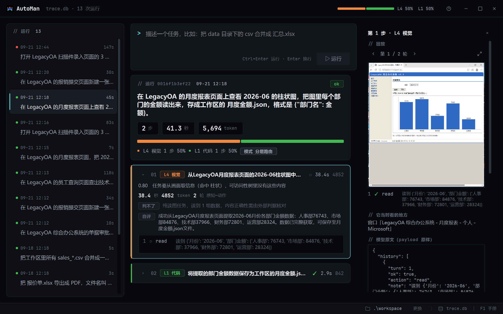
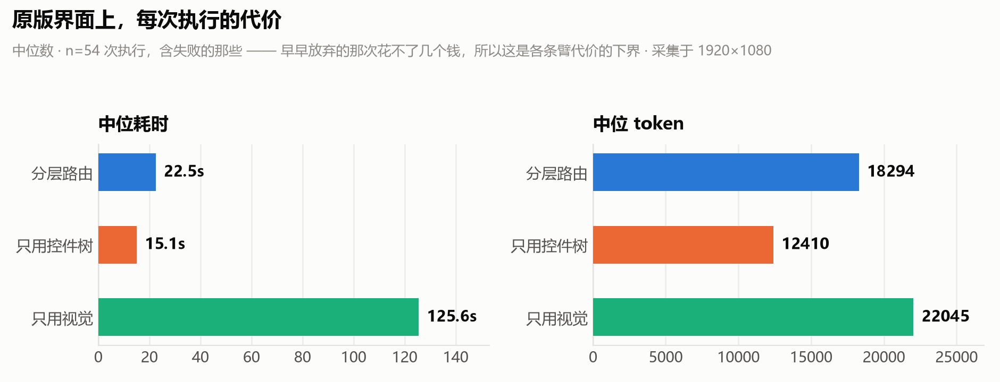
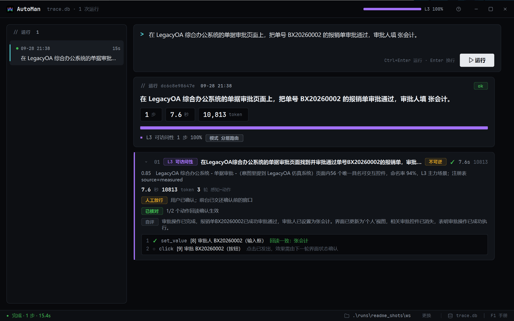
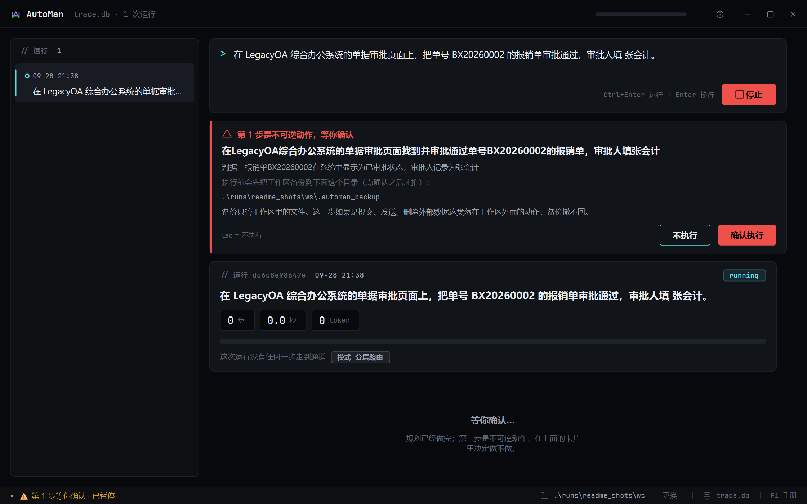
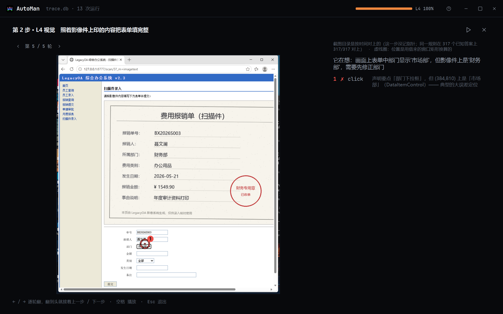
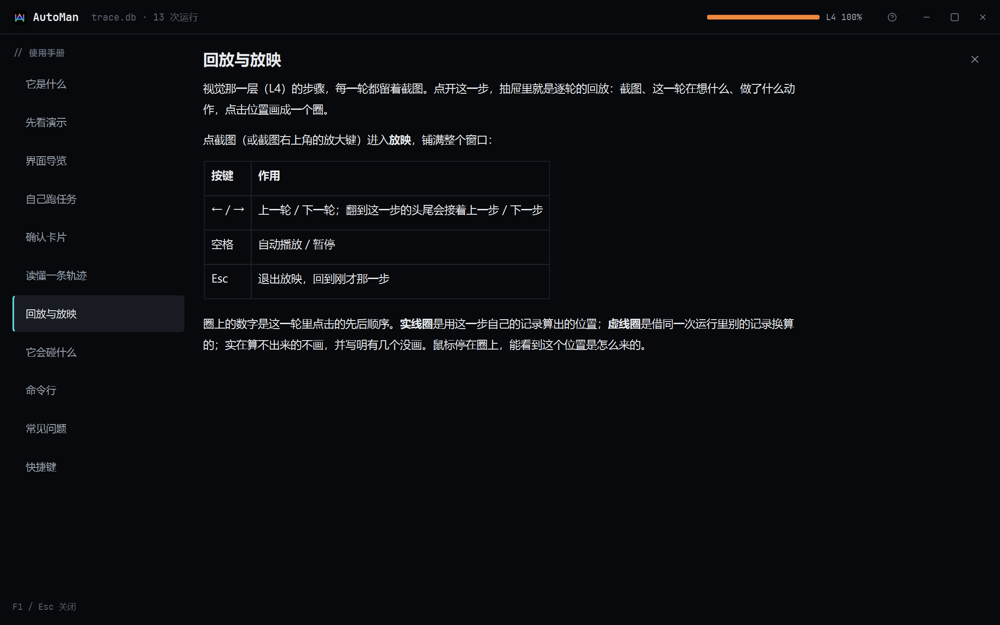

# AutoMan（凹凸曼）

**一个 Windows 桌面 Agent，研究的问题是：什么时候不该用视觉。**

你用一句话描述一件电脑上的活，它把活拆成几步，每一步挑最便宜、最稳的那一层去做：

| 层 | 怎么做 | 适合 |
|---|---|---|
| **L1 代码** | 写一段 Python，在沙箱里跑 | 文件、表格、文本 |
| **L2 应用接口** | 调 Excel 这类软件自己的 COM 接口 | 公式、重算、导出 |
| **L3 可访问性** | 读窗口的 UI Automation 控件树，按名字找控件 | 大多数桌面程序和网页 |
| **L4 视觉** | 截图给视觉模型，点坐标 | 只画在屏幕上、控件树里没有的东西 |

**它能做什么**（每一类都有随包示例任务或真机验证过的例子）：

- **文件与表格**：合并、清洗、去重一批 csv，生成 Excel —— L1 写代码完成，几秒钟；
- **Office 文档**：写公式并让 Excel 真实重算、导出 PDF —— L2 调 Excel 自己的接口；
- **网页和桌面程序**：在办公系统里查询、填表、审批 —— L3 按控件名字操作，每一步都回读核对；
- **只画在屏幕上的信息**：读 canvas 图表里的数值、照扫描件录入表单 —— L4 看截图，并用控件树交叉校验点位；
- **本机装着的程序**：「打开微信，给文件传输助手发一条消息」—— 从开始菜单认出程序，最小化的窗口也能找回；
  本机没装就直说，不会替你上网下载；
- 删除、提交、发送这类**撤不回的动作，一律先弹确认**。

"截图 → 视觉模型 → 点坐标"是现在桌面 Agent 最流行的做法，也是最慢、最贵、最容易点歪的做法。
这个项目的论点是：**视觉应该是兜底的最后一层，不是默认手段** —— 并且用一套可复现的实验去量它。

客户端截图摄于 2560×1600 @175% 缩放；轨迹本身是 1920×1080 上录的。
顶上那根彩色的条是这次任务各层干了多少活：绿 L1 · 蓝 L2 · 紫 L3 · 橙 L4。

---

## 核心实验：界面一变，谁先塌

**被试系统**是自带的仿真遗留办公系统 LegacyOA（Flask，员工 / 报销 / 审批 / 报表 / 扫描件录入）。
它有一组**界面变更开关**：同一个页面可以换文案、打乱布局和顺序，或者把按钮文字、字段名、表头
**原样渲染成图片**贴回去 —— 人眼看到的几乎一样，控件树里却什么名字都没有了（`imagetext`）。

**三条臂**，同一份代码、同一个模型，只差允许用哪几层：

- **分层路由（routed）**：四层都开，路由器按步挑；
- **只用控件树（tree-only）**：L1 + L3，没有视觉；
- **只用视觉（vision-only）**：L1 + L4，界面上的活全靠看图。

**9 条 GUI 任务 × 3 档界面变更 × 每格 2 次重复**，每条臂 54 次、共 162 次执行。
成功与否由**确定性判据**判（直接查被试系统的数据库或产出文件），不看 Agent 自己怎么说。

| 界面变更 | 分层路由 | 只用控件树 | 只用视觉 |
|---|---|---|---|
| 原版 | **18/18（100%）** | 12/18（67%） | 4/18（22%） |
| 换皮（文案 / 布局 / 顺序） | **15/18（83%）** | 9/18（50%） | 4/18（22%） |
| 文字渲染成图（掏空控件树） | **6/18（33%）** | 0/18（0%） | 4/18（22%） |

原版界面上，**按每交付一个通过判据的结果**算的代价（总耗时、总 token ÷ 成功次数）：

| | 分层路由 | 只用控件树 | 只用视觉 |
|---|---|---|---|
| 成功率 | 100% | 67% | 22% |
| 每个结果的耗时 | 28.6s | 23.4s | 648.0s |
| 每个结果的 token | 21,222 | 21,933 | 94,442 |

**能说的：**

1. **不需要视觉的时候别用视觉。** 原版界面上，只用视觉的那条臂成功率 22%，
   每交付一个结果的耗时是分层路由的 23 倍、token 是 4.5 倍。
2. **视觉当兜底，买到的是最后那一截成功率，而且按交付算几乎不加钱。**
   分层路由比只用控件树：时间多 22%，token 基本持平（−3%），成功率从 67% 到 100%。
   只用控件树在原版上失败的 6 次，恰好全是两张扫描件和一张 canvas 图表（每条 2 次）——
   正是信息只在画面上的那三条任务。
3. **表面换皮打不动分层。** 换文案、换布局、换顺序：两条线平行下移（100→83、67→50），谁也没塌。
4. **控件树被掏空之后，只用控件树那条臂一次都没交付（0/18）**，视觉那条线则从头到尾没动过。

**不能说的（证据不够）：**

- **"掏空之后，分层路由比只用视觉更好"** —— 33% 对 22% 是 6/18 对 4/18，在噪声里。
- 这张表每格 n=18，单格的成功率本身会晃；上面的结论都建立在**差距远大于这种晃动**的那几格上。

这张表是怎么来的、为什么引它而不是别的

- 数据：两个评测批次（routed + tree-only 108 次，vision-only 54 次），**同一份代码**。
  更早还有一张 162 次的表，那时视觉臂在旧代码上；改完代码之后三条臂按同一份代码重跑了一遍，
  **两张表不拼在一起用**。原版和换皮两档的 routed / tree-only 在两张表里逐格一致（第三次独立复现）。
- 采集环境：1920×1080 外接屏。开发后期换了 2560×1600 @175% 的屏，**这张表没有、也不会在新屏上补跑单格**
  —— 要重跑就整张重跑，并把分辨率写进表头。
- 视觉模型 `glm-4.5v`，文本模型 `glm-4.5-air`（智谱）。

---

## 量出来、然后改掉的几件事

实验不只是为了出一张表。几次最有价值的进展，都来自**先怀疑自己的数字**：

**"视觉点不准"这个数字本身是错的。** 早期矩阵里视觉臂有 32 次失败被判成"定位错误"。
逐条读完之后，**真正点偏了的只有 1 次（3%）**：23 次是浏览器的自动填充浮层盖住了表单，
5 次是模型自己按 Win 键叫出了别的窗口，3 次是校验器拿输入框的 placeholder 去比按钮文字。
修的是判据和测试环境，不是模型 —— 也因此**没有去做**原计划里的 Set-of-Mark 标注，证据不支持它。

**视觉臂真正的瓶颈是规划和动作预算，不是定位。** 判据修干净之后，失败原地转到了
"十轮也没声明完成"名下。于是把"模型调用次数"和"真实操作次数"两个预算拆开、
允许一轮返回几个动作、给模型输出里常见的 JSON 小瑕疵加一层修补。
同一套 54 次对照：**成功率 11% → 22%，配对 6 修 0 坏**；模型调用只多了 3%，
实际动作多了 44%，每交付一个结果的耗时降 39%、token 降 43%。

**止损器判死之后原地空转。** 路由器原先只在模型**自述**"这一层做不到"时才换上一层；
而"连着几轮推不动界面"的止损判定进不了这道门。放宽之后，**就地空转 31 次 → 0 次**
（不可逆的步骤除外：止损器证明的是"没看见变化"，不是"动作没生效"，重试可能提交两次）。

**量完决定不做的：经验缓存。** 按"任务 + 步骤意图"记住上次成功的那一层，
重放历史轨迹后覆盖率只有 9%，**记住的层和真正交付的层吻合 0 次** ——
因为键里没有"界面现在长什么样"，而界面会变正是这个项目的全部命题。

**"做完了但做错了"也要归因。** 失败归因原先只看报错的步骤，于是**失败得越安静越不会被归因**。
加了一层运行级规则后，53 条静默错误里 47 条能归进原来的六类，其中最多的是规划问题
（编造数据、没动手就声明完成、声称填了其实没填）。

> 失败归因规则的准确率正在做**预注册的盲标**（随机抽样 28 步级 + 12 运行级，隐去规则判词），
> 标完之前不引任何准确率数字。

---

## 客户端

PySide6 写的桌面客户端，**不改写执行记录**：发起任务是起一个子进程跑 CLI，界面崩了不影响执行，
命令行跑过的任务在界面里照样能回放。它唯一会写库的地方是用户自己整理列表 ——
删除进回收站（软删除，恢复后排回原位）、清空回收站（连同截图一起从硬盘上删掉）。

| | |
|---|---|
|  |  |
| **实时轨迹**：每一步走了哪层、花了多久、核对结果；「核对」和「自评」分两行，对不上的一眼可见 | **确认卡片**：删除、提交这类撤不回的动作先停下来问；回车不算同意；放行后把前台交还原窗口才动手 |
|  |  |
| **回放**：视觉步每一轮的截图、模型当时怎么想、点在了哪里；推算出来的点位画虚线并写明来历 | **使用手册**：F1 随时打开 |

截图摄于 2560×1600 @175% 缩放。

**它会碰什么、不会碰什么：**

- 写文件只在你指定的工作区里，写之前自动备份；
- 撤不回的动作先问你（终端里是 y/N，默认否）；
- 模型写的代码在沙箱里跑：审计钩子拦住工作区外的读写、联网、起进程、ctypes；
  这道沙箱防的是"模型写错了"，不是蓄意攻击，真正兜底的是前两条。

---

## 试用

**下载**：到本仓库的 [Releases](../../releases) 下载 `AutoMan-<日期>-win64.zip`（Windows 10/11 x64，约 110 MB，解压即用，不需要装 Python）。

解压后双击 `AutoMan.exe`。第一次打开会先显示一份演示轨迹：开发时真实跑过的 13 次运行，每种走法一条，含一次失败 —— **是挑出来的，不是成功率样本**。

自己跑任务需要一个智谱开放平台（open.bigmodel.cn）的 API key：把程序文件夹里的 `.env.example` 复制成 `.env`，填上 `VLM_API_KEY`，再在程序文件夹里打开终端运行 `automan-cli.exe doctor` 自检。包里带 16 条示例任务，按"只要密钥 / 需要 Excel / 需要 LegacyOA（包内自带的仿真办公系统）"分组。详见客户端里的使用手册（F1）。

> exe 没有数字签名，Windows 可能提示"已保护你的电脑"：点「更多信息 → 仍要运行」。操作鼠标键盘的任务运行期间请不要动鼠标。

---

## 局限（如实）

- **一台机器、一个被试系统。** LegacyOA 是为这个实验造的；真实软件的控件树质量参差得多，
  这正是 L4 存在的理由，但这里没有量真实软件。
- **n 小。** 每格 18 次，只有差距大的格子能下结论（上面已逐条标明）。
- **任务集 20 条**（本地文件 7、Excel 4、GUI 9），矩阵只用了其中 9 条 GUI 任务。
- **只测过一家模型**（智谱 glm-4.5v / glm-4.5-air）。
- 便携版的验证：从 zip 解压到全新目录，在打包版客户端里真跑过 L1（表格合并）和两条 L4 任务
  （读图表；照扫描件填表并提交，含确认卡片），均由确定性判据判定通过；打包脚本逐个检查
  exe / dll 的导入表，确认不依赖开发机上装过的运行库。但这些都是在开发机上做的，
  **还没在一台全新的 Windows 上实际跑过**。exe 未签名，SmartScreen 可能会拦。

---

## 技术文章

1. [什么时候不该用视觉：一个桌面 Agent 的通道路由实验](docs/articles/01-when-not-to-use-vision.md)
2. [先怀疑自己的数字：评测判据是怎么把对的动作判成错的](docs/articles/02-doubt-your-numbers.md)
3. [让一个会动鼠标的 Agent 值得信任：沙箱、确认、回放与打包](docs/articles/03-trustworthy-desktop-agent.md)

## 关于本仓库

本仓库只用于展示：说明文档、技术文章和可下载试用的安装包。**源码不公开**，未附开源许可证，保留所有权利；
安装包可自由下载试用，但不得再分发或用于商业用途。客户端随包带的 JetBrains Mono 字体为 OFL 许可（包内 `OFL.txt`）。

问题和反馈欢迎提 Issue。
