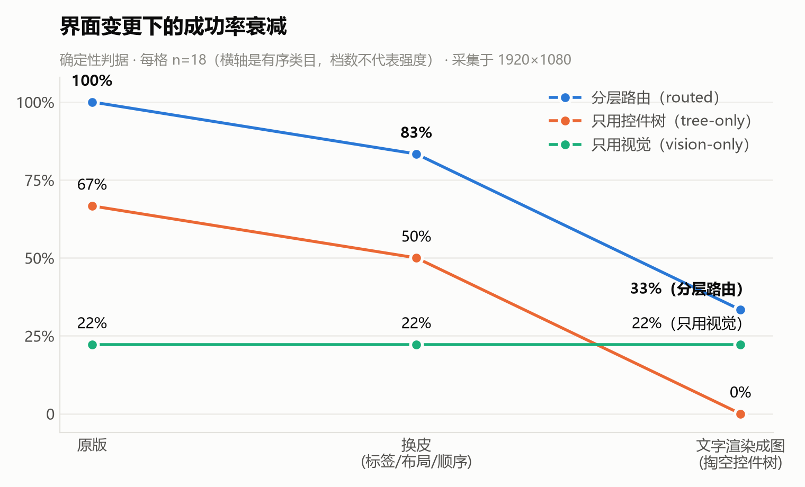

# 什么时候不该用视觉：一个桌面 Agent 的通道路由实验

> AutoMan 技术文章 · 第 1 篇 / 共 3 篇

现在做桌面 Agent，最顺手的路子是"截图 → 视觉模型 → 点坐标"：什么界面都能看，什么按钮都能点，
一套办法走天下。它的问题也很直白 —— **慢、贵、容易点歪**。在我的测试机上（1920×1080），
一轮视觉调用是一张截图、约 2.8k 输入 token、十几秒；而同一件事如果能从控件树里按名字找到按钮，
几百毫秒就够了。

所以这个项目没有问"视觉 Agent 怎么做得更准"，而是问了一个更朴素的问题：

**什么时候不该用视觉？**

## 四层，从便宜到贵

AutoMan 把桌面上能做的动作分成四层，每一步挑能做成这件事的最便宜那一层：

| 层 | 怎么做 | 一步大概要什么 |
|---|---|---|
| L1 代码 | 生成一段 Python，在沙箱里跑 | 一次文本模型调用 + 一次沙箱执行 |
| L2 应用接口 | 调 Excel 的 COM 接口 | 一次文本模型调用 + 几次接口调用 |
| L3 可访问性 | 读 UI Automation 控件树，按名字找控件 | 每一轮：读一次树（Edge 上约半秒）+ 一次文本模型调用 |
| L4 视觉 | 截图给视觉模型，按坐标点 | 每一轮：一张截图 + 约 2.8k 输入 token + 十几秒 |

"合并几个 CSV"不该去点 Excel 的菜单，它是一段 pandas；"在网页表单里填一个名字"不该看截图，
控件树里那个输入框就叫"姓名"。只有**信息只画在屏幕上、控件树里没有**的时候 ——
扫描件、canvas 画出来的图表 —— 视觉才是唯一的路。

这条原则写下来只有一句：**该不该用视觉，看树里有没有内容。** 难的是证明它。

## 实验装置：一个会"换皮"的遗留系统

要证明"分层比单用视觉好"，需要一个能**控制界面变化**的被试系统。真实软件做不到这一点，
所以我写了一个仿真的遗留办公系统 LegacyOA（Flask）：员工、报销、审批、月度报表、扫描件录入，
外加一组**界面变更开关** —— 换文案（"提交"→"确认提交"）、换主题、打乱布局和顺序、弹窗。
所有变更都是确定性的（随机种子由变更名算出来），而且只动表象不动语义：提交按钮可以改名，
不能改成取消按钮。

**第一个意外：前六个开关对 L3 零影响。**

这组开关是照着"硬编码选择器的脚本"设计的 —— 那种脚本一换文案就挂。可 L3 不是脚本，
是一个 LLM 在读控件树：换主题、换布局是纯 CSS，树一个字没变；"提交"改成"确认提交"，
模型读得懂；顺序打乱，按名字找控件的人根本无所谓。14 次探路全部通过，
每次的 token 数几乎是一条直线 —— **模型根本没察觉界面动过**。

自变量是死的，衰减曲线就画不出来。于是补了第七个开关 `imagetext`：
把按钮文字、表单字段名、表头**原样渲染成 PNG 贴回去**。人眼看到的页面几乎一模一样，
可访问性树里却什么名字都没有了。在单据审批页上，树里带业务词的可交互控件从 53 个掉到 5 个
（剩下的是故意留成文字的导航链接，不然每条任务都卡在找入口上，量到的就是"导航坏了"）。

这个开关的意义在于，它**直接操作化了"树里有没有内容"这个量** —— 正是路由原则里的那个量。

## 三条臂、162 次执行

同一份代码、同一个模型，只差允许用哪几层：

- **分层路由**：四层都开；
- **只用控件树**：L1 + L3；
- **只用视觉**：L1 + L4。

9 条 GUI 任务（审批、驳回、录入员工、提交报销、查询写文件、导出报表、两张扫描件、一张 canvas 图表），
每条在三档界面上各跑 2 次，每条臂 54 次。成功与否只看**确定性判据** ——
直接查被试系统的数据库或产出文件，不看 Agent 自己说没说成。

| 界面变更 | 分层路由 | 只用控件树 | 只用视觉 |
|---|---|---|---|
| 原版 | **18/18（100%）** | 12/18（67%） | 4/18（22%） |
| 换皮（文案 / 布局 / 顺序） | **15/18（83%）** | 9/18（50%） | 4/18（22%） |
| 文字渲染成图 | **6/18（33%）** | 0/18（0%） | 4/18（22%） |

原版界面上，按**每交付一个通过判据的结果**算（总耗时、总 token 除以成功次数）：

| | 分层路由 | 只用控件树 | 只用视觉 |
|---|---|---|---|
| 每个结果的耗时 | 28.6s | 23.4s | 648.0s |
| 每个结果的 token | 21,222 | 21,933 | 94,442 |

为什么按"每个结果"算，而不是按"每次执行"？因为失败的执行也花钱。只用控件树那条臂跑一趟的
中位耗时是 15.1s，比分层路由的 22.5s 快得多 —— 但它三次里有一次什么都没交出来。
按交付算，分层路由只多花 22% 的时间，token 反而略少（−3%），把成功率从 67% 抬到了 100%。

## 能说的四句话

**一、不需要视觉的时候别用视觉。** 原版界面上，只用视觉那条臂成功率 22%，
每交付一个结果的耗时是分层路由的 23 倍、token 是 4.5 倍。这是整个项目最硬的一条，差距远在噪声之外。

**二、视觉当兜底，买到的是最后那一截。** 原版界面上，只用控件树失败的 6 次，
**恰好全是两张扫描件和那张 canvas 图表，每条 2 次，一次不多一次不少** —— 正是"信息只在画面上"
的那三条任务。分层路由让这几步走 L4、其余步照旧走 L1/L3，于是多出来的那 33 个百分点，
按交付算几乎是白送的。

**三、表面换皮打不动分层。** 换文案、换布局、换顺序，分层路由 100→83，只用控件树 67→50，
两条线平行下移，谁也没塌。这一档是留着证伪自己的 —— 如果"LLM 读树"对换皮很脆弱，
它会在这里崩，它没崩。

**四、控件树被掏空之后，只用控件树那条臂一次都没交付。** 0/18。视觉那条线从头到尾没动过，
它在原版上就只有 22%，没有可衰减的高度。

## 不能说的那一句

掏空档上，分层路由 33%、只用视觉 22%。**很想说"就算树被掏空，路由也比单用视觉强"** ——
但那是 6/18 对 4/18，差两次执行。每格只有 18 次，同一格重跑两遍翻转几次是常事，
这个差距在噪声里。所以这句话不写进任何结论。

这个项目在这件事上吃过亏：早期有一张 81 次的表，其中一格的差距看起来很漂亮，
按同样的配置重跑就没能复现。从那以后规矩是：每格至少 n=18、带重复；
只引**差距远大于同格翻转幅度**的格子；改了代码就整张表重跑，**新旧两张表的格子不拼在一起用**。

## 视觉臂为什么只有 22%

直觉上会以为是"视觉模型点不准"。一开始我也这么以为 —— 早期矩阵里视觉臂的失败，
有一大半被判成了"定位错误"。

逐条读完之后，32 条"定位错误"里**真正点偏了的只有 1 条**。其余是：浏览器的自动填充浮层
盖住了表单（23 条）、模型自己按 Win 键叫出了别的系统窗口（5 条）、校验器拿输入框的 placeholder
去比按钮文字（3 条）。修掉判据和测试环境之后，失败原地转到了另一个名下：
**"十轮也没声明完成"** —— 规划和动作预算。

于是做了几件和"定位"无关的事：把"模型调用次数"和"真实操作次数"两个预算拆开，
允许一轮返回几个动作，给模型输出里常见的 JSON 小瑕疵加一层修补。同样 54 次对照，
成功率从 11% 到 22%，配对 **6 修 0 坏**；模型调用只多了 3%，实际发出的动作多了 44%。

这件事的细节在[第 2 篇](02-doubt-your-numbers.md)里。这里只想说一点：**如果当时照着直觉去做
Set-of-Mark 标注来"提高定位精度"，会花掉一周，然后什么都改善不了。**

## 路由本身：一个放宽，一个不做

**放宽：止损之后该换层。** 路由器原先只在模型**自述**"这一层做不到"时才换上一层。
可实际量出来，更常见的死法是止损器判定"连着几轮推不动界面" —— 它说的是同一件事，
只是一句是观测、一句是自述，而观测那个来源进不了换层的门。放宽之后，
**止损器判死之后原地空转的次数从 31 次降到 0 次**。

有一个例外必须留：**不可逆的步骤不换层重做。** 止损器证明的是"这一层没看见变化"，
不是"动作没生效" —— 在"提交"上重试，风险是提交两次。

（新机制在那轮 54 次对照里只真正触发了 1 次，成功率的任何变化都不能记在它头上。
能说的只有"就地空转 31→0"。）

**不做：经验缓存。** 原计划里有"记住上次在这类步骤上哪一层成功了，下次直接走"。
先量上限：按"任务 + 步骤意图"做键，历史轨迹里 587 个重复步，缓存只够改写 9%；
而这 9% 里，**记住的那一层和真正交付的那一层吻合 0 次**。原因很简单 ——
键里没有"界面现在长什么样"，而界面会变，正是这个项目的全部命题。换一批数据再量一遍，
还是 0 次。不做。

## 小结

- **能下沉就下沉**：能写代码的不点界面，能读树的不看截图。
- **视觉是兜底**：它补上的是"信息只在画面上"的那一截，按交付算几乎不加钱。
- **判断标准是"树里有没有内容"**，而不是"界面长什么样"。

实验代码、162 次的原始结果和画图脚本都在仓库里，可以原样复现
（换了显示器请整张表重跑，并把分辨率写进表头 —— 这个项目后期换了屏，旧表因此冻结，
没有在新屏上补跑任何一格）。

下一篇讲这个过程中最有用的一个习惯：[先怀疑自己的数字](02-doubt-your-numbers.md)。
