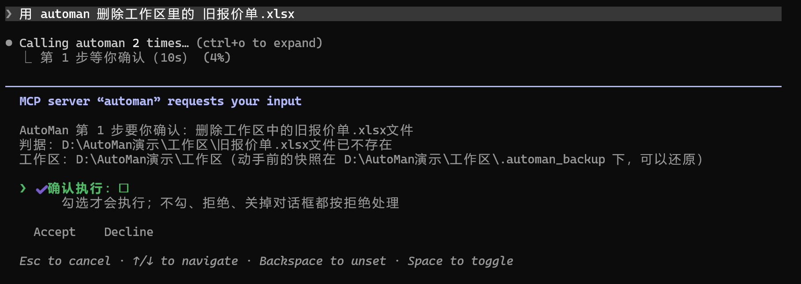
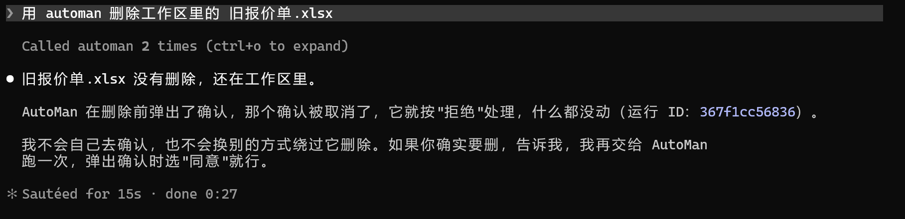

# 把一个 Agent 交给另一个 Agent：AutoMan 的 MCP 服务端

> AutoMan 技术文章 · 第 5 篇 / 共 5 篇

MCP（Model Context Protocol）是让 Agent 调用外部工具的一套标准协议。给 AutoMan 加一个 MCP 服务端之后，
Claude Code 这类编程 Agent 就能直接说一句"把这三张表合并成汇总.xlsx"，由 AutoMan 去桌面上把活干完。

接口本身不难写，官方 SDK 几十行就能跑起来。难的是三个问题：**交出去什么、确认谁来做、怎么停下来。**

## 一、交出去的是"整个任务"，不是"写一个单元格"

最直接的做法是把每一层的能力都包成工具：`excel_write_range`、`uia_click`、`run_python`……
外面的 Agent 自己编排。我没有这么做。

AutoMan 的安全性不在某一个通道里，在**编排层**：写操作只落在工作区、每个写步骤之前拍快照、
中途失败自动回滚、撤不回的动作必须人确认、每一步执行完都要核对、最后还有一次终局判定。
把"写单元格"直接交出去，外面的模型能写，但没有人替它备份、替它核对、替它问人 —— 它绕过了这一整层。

所以只交出四个工具：

| 工具 | 只读 | 做什么 |
|---|---|---|
| `run_task(task)` | 否 | 交给 AutoMan 一件完整的事，跑完返回一份报告 |
| `list_workspace()` | 是 | 工作区里有哪些文件 |
| `list_runs(limit)` | 是 | 这个工作区最近的运行 |
| `get_run(run_id)` | 是 | 一次运行的逐步记录 |

`run_task` 的参数**只有任务本身**。工作区、开哪几层、用哪个模型，由启动服务端的人在命令行上定，
调用方改不了；参数里也没有任何"跳过确认"的开关 —— 有一条测试专门守着这件事。

报告是结构化的：结论、每一步由哪一层做的、核对结果、L2 用了哪种方式及原因、问过用户什么、
工作区里新增 / 修改 / 删除了哪些文件。任务没做成也是一份正常的报告，原因写在出错的那一步里；
只有"任务是空的""已有任务在跑""执行进程起不来"这三种情况才算工具出错。

## 二、确认只能来自人

AutoMan 遇到删除、提交、覆盖已有数据这类动作，会停下来问。经 MCP 调用时，问谁？

**不能问调用它的那个模型。** 那个模型就是想把事办成的一方，让它回答"要不要删"，等于没问。
MCP 里有一个机制正好用在这里：**elicitation** —— 服务端在调用过程中向客户端发一个表单，
由客户端的界面直接摆到用户面前，答案直接回到服务端，中间不经过模型。

表单只有一个「确认执行」勾选框，**默认不勾**。判定规则和终端、客户端那两条确认通道一样严：
只有"用户提交了、而且勾了"才放行；拒绝、取消、提交了没勾、10 分钟没人回答、客户端根本不支持
elicitation —— 一律按拒绝处理，并且把是哪一种拒绝写进轨迹。

在 Claude Code 里让 AutoMan 删除一个文件：AutoMan 停在第 1 步，经 MCP 客户端直接问用户，「确认执行」默认不勾。

取消之后文件没动；调用方的模型也明说不会自己确认、不会换别的方式绕过去删。

截这张图的时候还发现，Claude Code 只摊开说明的头两三行，其余折成"… (+5 more lines)"。
原先第一行是一句"要做一件需要你确认的事"的套话，真正要做什么挤在第三行，判据和快照位置全被折掉了 ——
现在三行写完，第一行就是要做什么。

最后这一条是写完之后补的。原先子进程那头只收到一个 `false`，轨迹里一律记成"用户拒绝"，
可"客户端不支持弹窗"和"用户点了拒绝"是两回事 —— 前者用户根本没被问到，记成"用户拒绝"是在替一个没开口的人说话。
于是确认协议的答案加了一个可选的理由字段，**只改理由、不改结论**：放行仍然只认 `ok` 恰好是 `true`。

还有一个协议版本上的坑。MCP 最新的 2026-07-28 版是无状态的：服务端不能在一次调用的中途向客户端发请求，
要问人得先把调用结束掉、让客户端带着答案重新调用。AutoMan 的确认发生在执行中途，接不上这一套。
眼下本机 Claude Code 协商的是 2025-11-25 版，可以中途问；遇到无状态的连接，问不了人就拒绝 —— 也有测试。

## 三、执行放在子进程里

服务端自己不执行任务，而是起一个子进程跑 `automan run`，和桌面客户端走同一条路。理由有三个：

1. **stdout 是协议线。** stdio 模式的 MCP 用标准输出传 JSON-RPC 消息。内核里任何一句 `print`
   落到服务端的标准输出上，就是一帧坏掉的消息。放进子进程，它的输出是我们读的一根管子。
2. **COM 绑线程。** Office 的 COM 对象绑在创建它的线程上，而服务端是一个异步事件循环。
   子进程里是 L2 一直以来的单线程跑法，评测台量过的也是那条路。
3. **停得下来。** 用户在客户端里取消、整体超时，都是杀掉子进程这一件事。

子进程往外递三样东西，各有出处：**进度**是一份机器读的事件行（规划完成、第几步交给了哪一层、
这一步成没成），只报进度、不当事实来源；**确认请求**沿用客户端那份一行文本的协议；
**结论**读轨迹库 —— 和客户端看到的是同一份事实。服务端不 import 编排层、通道、沙箱和模型调用，
有一条禁引测试守着。

**"停下来"还有一种情况：服务端自己被直接杀掉。** MCP 客户端退出时常常这样，来不及走任何清理代码。
子进程要是活下来，就会在没人看着的情况下继续操作桌面。所以子进程被放进一个 Windows 作业对象，
设置成"作业句柄一关就结束里面的进程"：服务端一没，它跟着没。同时允许它**再起的进程脱离作业** ——
任务里打开给用户看的记事本、WPS 不能因为服务端退出就被一并关掉。

## 四、真用一遍，才看见的三件事

自动测试用 SDK 的进程内客户端真跑协议，执行那头是真的编排层加假模型，不花钱、不碰桌面。
但下面这三件事，都是在本机 Claude Code 里真跑任务、真点确认框才看见的：

**确认记录对不上。** 用户在确认框里同意删除一个文件，报告的步骤备注写着"用户已确认（经 MCP 客户端）"，
"确认记录"那个字段却是空的；前两次拒绝也一样。原因是两种确认落在库里不同的地方：
执行中途的覆盖确认记在一个列表里，而整步的放行（删除这类不可逆动作）记在另一个键、被拒时记在错误信息里。
报告只读了前者。现在两种都进确认记录 —— 回看运行时，"问过谁、谁批的"只看这一个字段。

**终局判定误报"建议人工过目"。** 让 AutoMan 在 WPS 里用公式重算一列工资，结果完全正确，报告却标着"建议人工过目"。
负责最后判定的模型只看得到一份工作区摘要，而这份摘要是用 pandas 读的：**只读第一张表、只有算出来的值**。
判据说"用公式算"，它手里只有 7200、8100 这几个数，看不出是公式算的还是写死的。
现在摘要列出每一张表，并写明哪些列是公式、举一个例子、附上缓存的值（文件里没有缓存值就照实说"没算出"）。
同一个任务重跑，判定的理由变成了"D 列所有单元格都包含公式，且计算结果正确"。

**WPS 里的文档跑完还开着。** WPS 本来就开着时，AutoMan 打开的那份工作簿任务结束后一直留在那儿，
工作区里留着 `~$工资.xlsx` 锁文件，用户自己再去改就会撞上占用。现在终局判定之后关掉它 ——
只关**AutoMan 自己打开的、已经存过盘的**：用户在任务之前就开着的不碰；还有没保存的修改的不关、不存、不丢，
留给人看；任务明说"打开给我看"的也不关。

## 五、验证到了哪一步

- 自动测试：MCP 相关 22 条 —— 工具清单、正常跑完、失败回滚、还没开始就崩、确认的各种回答、
  执行中途的覆盖确认、无状态连接上拒绝、超时和取消都会杀掉子进程、一次只跑一个、只读工具只看得见自己的工作区，
  以及真起一个服务端进程走标准输入输出握手（验它的标准输出是干净的）。
- 本机 Claude Code 端到端：表格合并（L1）、WPS 里改公式并经确认框同意覆盖（L2）、删除文件（拒绝 / 同意），
  以及用户本人在交互式会话里点确认框的三次运行。
- 便携版：打包脚本的自检里加了一步，直接对打出来的 exe 写三行 JSON-RPC 握手、列工具。

**没验到的**：只在 Claude Code 上验过，别的 MCP 客户端支不支持 elicitation 没试 —— 不支持的客户端里，
任何需要确认的动作都会被拒绝，这是故意的；"一次只跑一个"只在同一个服务端进程里成立，
桌面客户端和 MCP 同时在同一个工作区里跑任务，彼此不知道。

## 小结

把一个 Agent 交给另一个 Agent，接口是最容易的部分。真正要回答的是：

- **交出去的粒度**决定了护栏还在不在。交整个任务，护栏跟着走；交原子操作，护栏就留在了原地。
- **确认必须绕开调用方**，直达人。做不到的时候，答案是"不做"，而不是"先做了再说"。
- **停得下来**包括自己被杀掉的那一种。

设计细节、全部测试项和已知问题见 [docs/MCP服务端.md](../MCP服务端.md)。
